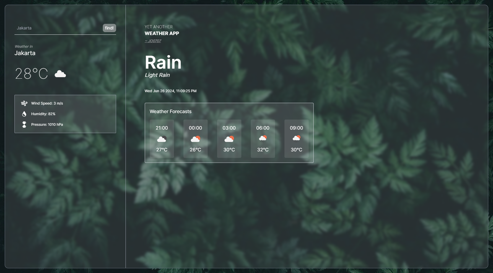

<h1 align="center">Yet Another Weather App</h1>

<p align="center">
  
</p>

<p align="center">
    Yet another weather app that uses basic HTML and TailwindCSS (well, also NodeJS and Typescript 😅).
</p>

## Libraries and Tools

-   [TailwindCSS](https://tailwindcss.com/)
-   [NodeJS](https://nodejs.org/en)
-   [Typescript](https://www.typescriptlang.org/)

## App

Web : [Yet Another Weather App](https://qr-gen-nu.vercel.app/)

## Run & Build

index.html is the main file
/src/index.ts is the main typescript file

```bash
git clone https://github.com/jo0707/another-weather-app
cd another-weather-app
npm install

# run
npm dev
```

Great! now Tailwind and Typesript will watch for changes and update the `dist` folder.
